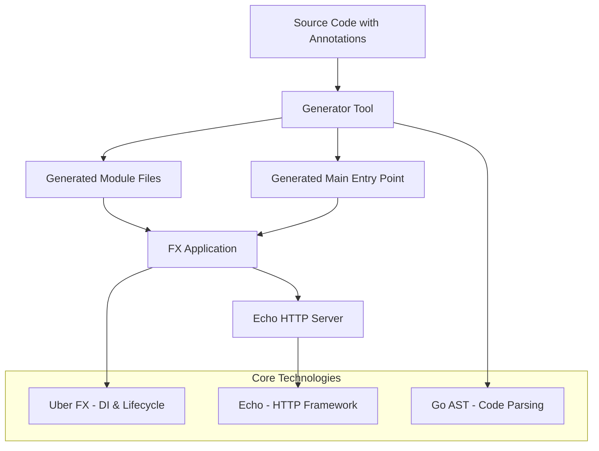
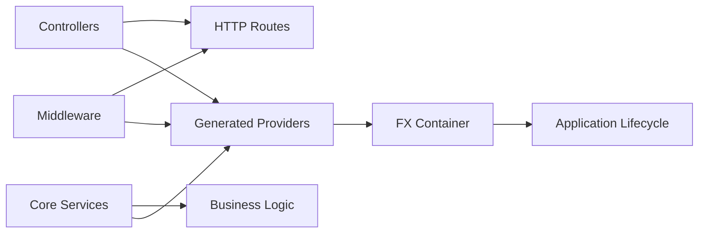

# Design Document

## Overview

Axon is an annotation-driven framework for building scalable, modular, and maintainable web services in Go. The framework uses code generation to eliminate boilerplate code while leveraging proven technologies like Uber FX for dependency injection, Echo for HTTP handling, and Go's AST parsing capabilities for annotation processing.

The core philosophy is to let developers focus on business logic by declaratively defining application structure through annotations in comments. The generator tool processes these annotations to create the necessary wiring code automatically.

## Architecture

### High-Level Architecture



### Component Architecture



## Components and Interfaces

### 1. Annotation Parser

**Purpose**: Parse Go source files and extract annotation metadata

**Key Components**:
- AST Walker: Traverses Go syntax trees to find annotated structs and methods
- Annotation Extractor: Parses comment-based annotations using regex patterns
- Metadata Builder: Constructs structured data models from parsed annotations

**Interface**:
```go
type AnnotationParser interface {
    ParseDirectory(path string) (*PackageMetadata, error)
    ExtractAnnotations(file *ast.File) ([]Annotation, error)
}

type Annotation struct {
    Type       AnnotationType // controller, route, middleware, core, interface
    Target     string         // struct or method name
    Parameters map[string]string
    Flags      []string
}
```

### 2. Code Generator

**Purpose**: Generate FX modules and wiring code based on parsed annotations

**Key Components**:
- Template Engine: Uses Go templates to generate code
- Module Builder: Creates FX module structures
- Provider Generator: Creates dependency injection providers
- Route Wrapper Generator: Creates HTTP handler wrappers

**Interface**:
```go
type CodeGenerator interface {
    GenerateModule(metadata *PackageMetadata) (*GeneratedModule, error)
    GenerateMainFile(modules []ModuleReference, outputPath string) error
}

type GeneratedModule struct {
    PackageName string
    FilePath    string
    Content     string
    Providers   []Provider
}
```

### 3. Middleware Registry

**Purpose**: Track and validate middleware components across packages

**Interface**:
```go
type MiddlewareRegistry interface {
    Register(name string, middleware *MiddlewareMetadata) error
    Validate(middlewareNames []string) error
    Get(name string) (*MiddlewareMetadata, bool)
}

type MiddlewareMetadata struct {
    Name        string
    PackagePath string
    StructName  string
}
```

### 4. Route Handler Generator

**Purpose**: Generate wrapper functions for HTTP route handlers

**Key Features**:
- Parameter binding and type conversion
- Response marshalling
- Error handling
- Context injection

**Implementation**:
Route generation is handled by functions in the `templates` package:
```go
// GenerateRouteWrapper generates a complete route wrapper function
func GenerateRouteWrapper(route RouteMetadata, controllerName string, parserRegistry ParserRegistryInterface) (string, error)

// GenerateParameterBindingCode generates parameter binding code for multiple parameters  
func GenerateParameterBindingCode(parameters []Parameter, parserRegistry ParserRegistryInterface) (string, error)

type RouteMetadata struct {
    Method      string
    Path        string
    HandlerName string
    Parameters  []Parameter
    ReturnType  ReturnTypeInfo
    Middlewares []string
    Flags       []string
}
```

### 5. Lifecycle Manager

**Purpose**: Handle component lifecycle for services with -Init flag

**Interface**:
```go
type LifecycleManager interface {
    GenerateLifecycleProvider(service *ServiceMetadata) (string, error)
}

type ServiceMetadata struct {
    Name        string
    HasStart    bool
    HasStop     bool
    Dependencies []string
}
```

## Data Models

### Core Data Structures

```go
// PackageMetadata represents all annotations found in a package
type PackageMetadata struct {
    PackageName   string
    PackagePath   string
    Controllers   []ControllerMetadata
    Middlewares   []MiddlewareMetadata
    CoreServices  []CoreServiceMetadata
    Interfaces    []InterfaceMetadata
}

// ControllerMetadata represents a controller and its routes
type ControllerMetadata struct {
    Name         string
    StructName   string
    Routes       []RouteMetadata
    Dependencies []string
}

// CoreServiceMetadata represents a core service
type CoreServiceMetadata struct {
    Name         string
    StructName   string
    HasLifecycle bool
    IsManual     bool
    ModuleName   string
    Dependencies []string
}

// Parameter represents a route parameter
type Parameter struct {
    Name     string
    Type     string
    Source   ParameterSource // path, body, context
    Required bool
}

type ParameterSource int

const (
    ParameterSourcePath ParameterSource = iota
    ParameterSourceBody
    ParameterSourceContext
)

// ReturnTypeInfo describes handler return signature
type ReturnTypeInfo struct {
    Type         ReturnType
    DataType     string
    HasError     bool
    UsesResponse bool
}

type ReturnType int

const (
    ReturnTypeDataError ReturnType = iota
    ReturnTypeResponseError
    ReturnTypeError
)
```

### Generated Code Templates

The generator uses Go templates to create consistent code structures:

**Provider Template**:
```go
func New{{.StructName}}({{range .Dependencies}}{{.Name}} {{.Type}}, {{end}}) *{{.StructName}} {
    return &{{.StructName}}{
        {{range .Dependencies}}{{.Name}}: {{.Name}},{{end}}
    }
}
```

**Route Wrapper Template**:
```go
func {{.WrapperName}}(handler *{{.ControllerName}}) echo.HandlerFunc {
    return func(c echo.Context) error {
        {{range .Parameters}}
        {{if eq .Source "path"}}
        {{.Name}}, err := {{.ConversionFunc}}(c.Param("{{.Name}}"))
        if err != nil {
            return echo.NewHTTPError(http.StatusBadRequest, "Invalid {{.Name}}")
        }
        {{end}}
        {{end}}
        
        {{if .HasBodyParam}}
        var body {{.BodyType}}
        if err := c.Bind(&body); err != nil {
            return echo.NewHTTPError(http.StatusBadRequest, err.Error())
        }
        {{end}}
        
        {{.CallHandler}}
        
        {{.HandleResponse}}
    }
}
```

## Error Handling

### Generator Error Handling

1. **Parse Errors**: Invalid annotation syntax, missing required parameters
2. **Validation Errors**: Unknown middleware references, invalid handler signatures
3. **Generation Errors**: Template rendering failures, file system errors

**Error Types**:
```go
type GeneratorError struct {
    Type     ErrorType
    File     string
    Line     int
    Message  string
    Cause    error
}

type ErrorType int

const (
    ErrorTypeAnnotationSyntax ErrorType = iota
    ErrorTypeValidation
    ErrorTypeGeneration
    ErrorTypeFileSystem
)
```

### Runtime Error Handling

1. **Parameter Binding Errors**: Return 400 Bad Request for invalid parameters
2. **Handler Errors**: Return 500 Internal Server Error for unhandled errors
3. **Middleware Errors**: Propagate through Echo's error handling
4. **Lifecycle Errors**: Fail application startup/shutdown gracefully

## Testing Strategy

### Unit Testing

1. **Annotation Parser Tests**:
   - Test parsing of valid annotations
   - Test error handling for invalid syntax
   - Test edge cases and malformed input

2. **Code Generator Tests**:
   - Test template rendering with various inputs
   - Test generated code compilation
   - Test module structure correctness

3. **Registry Tests**:
   - Test middleware registration and validation
   - Test duplicate name handling
   - Test cross-package references

### Integration Testing

1. **End-to-End Generator Tests**:
   - Test complete generation pipeline
   - Test generated application compilation
   - Test runtime behavior of generated code

2. **Framework Integration Tests**:
   - Test FX integration and dependency injection
   - Test Echo integration and route handling
   - Test lifecycle management

### Test Structure

```go
// Test package structure
package generator_test

type GeneratorTestSuite struct {
    suite.Suite
    tempDir    string
    generator  *Generator
    parser     *AnnotationParser
}

func (s *GeneratorTestSuite) TestControllerGeneration() {
    // Test controller annotation processing
}

func (s *GeneratorTestSuite) TestRouteGeneration() {
    // Test route wrapper generation
}

func (s *GeneratorTestSuite) TestMiddlewareIntegration() {
    // Test middleware application
}
```

### Generated Code Testing

The framework should generate testable code:

1. **Interface Generation**: Enable easy mocking for unit tests
2. **Dependency Injection**: Support test doubles and mocks
3. **Lifecycle Hooks**: Allow testing of startup/shutdown behavior

## Implementation Phases

### Phase 1: Core Infrastructure
- Annotation parser implementation
- Basic code generator with templates
- Simple controller and route support

### Phase 2: Advanced Features
- Middleware system implementation
- Core service lifecycle management
- Interface generation

### Phase 3: CLI and Tooling
- Command-line interface
- File watching and regeneration
- Error reporting and validation

### Phase 4: Documentation and Examples
- Comprehensive documentation
- Example applications
- Best practices guide

## Security Considerations

1. **Code Generation Security**:
   - Validate all user input in annotations
   - Sanitize generated code to prevent injection
   - Limit file system access during generation

2. **Runtime Security**:
   - Proper parameter validation in generated handlers
   - Secure error message handling
   - Input sanitization for path parameters

3. **Dependency Security**:
   - Pin dependency versions
   - Regular security audits of dependencies
   - Minimal dependency footprint

## Performance Considerations

1. **Generation Performance**:
   - Efficient AST parsing and caching
   - Parallel processing of packages
   - Incremental regeneration

2. **Runtime Performance**:
   - Minimal overhead in generated wrappers
   - Efficient parameter binding
   - Optimized dependency injection

3. **Memory Usage**:
   - Avoid memory leaks in generated code
   - Efficient string handling in templates
   - Proper resource cleanup in lifecycle hooks